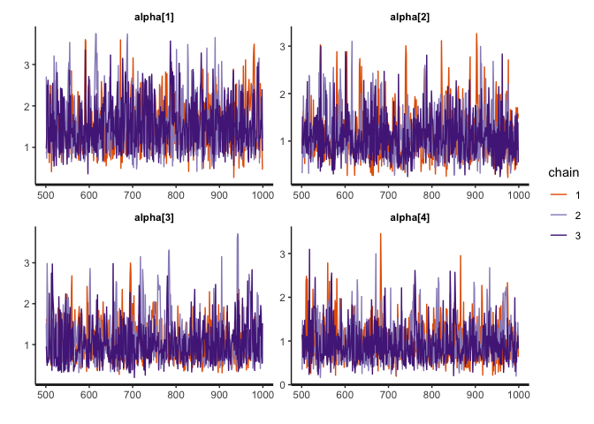

<!-- README.md is generated from README.Rmd. Please edit that file -->

# bmggum

<!-- badges: start -->

[](https://cran.r-project.org/package=bmggum)
[](https://cranlogs.r-pkg.org/badges/grand-total/bmggum "Total downloads")
<!-- badges: end -->

The goal of bmggum is to estimate Multidimensional Generalized Graded
Unfolding Model (MGGUM) using Bayesian method. Specifically,the R
package **rstan** that utilizes the Hamiltonian Monte Carlo sampling
algorithm was used for estimation. Below are some important features of
the bmggum package:

1.  Allows users to incorporate person covariates (e.g., age, gender,
    education) into the estimation to improve estimation accuracy.
2.  Automatically deals with missing data in a way similar to how full
    information maximum likelihood handles missing data.
3.  Allows users to estimate the **multidimensional version** of three
    unfolding models that are available in the software GGUM2004
    (Roberts, Fang, Cui, & Wang, 2006).
      - UM8: The Generalized Graded Unfolding Model (GGUM).
      - UM4: The Partial Credit Unfolding Model, which is the GGUM with
        all alphas constrained to 1.
      - UM7: The Generalized Rating Scale Unfolding Model, which is the
        GGUM with equal taus across items.
4.  Five functions (i.e., bmggum( ), extract( ), modfit( ), bayesplot(
    ), and itemplot( )) are provided for model estimation, results
    extraction, model fit examination (e.g.,waic, loo, chisq/df), and
    plottings, respectively.

## Installation

You can install bmggum from CRAN:

``` r
install.packages("bmggum")
```

You can install the development version of bmggum from GitHub:

``` r
devtools::install_github("Naidantu/bmggum")
```

## Example

This is a basic example which shows you how to prepare data, fit the
model, extract and plot results.

``` r
library(bmggum)

## basic example code
## Step 1: Input data
# 1.1 Response data in wide format
GGUM.Data <- c(1,4,4,1,1,1,1,1,1,1,4,1,1,3,1,1,NA,2,NA,3,2,2,2,1,3,2,NA,2,1,1,2,1,NA,NA,NA,1,3,NA,1,2)
GGUM.Data <- matrix(GGUM.Data,nrow = 10)

# 1.2 A two-row data matrix: the first row is the item number (1,2,3,4...); the second row indicates the signs of delta for each item (-1,0,1,...). For items that have negative deltas for sure, "-1" should be assigned; for items that have positive deltas, "1" should be assigned; for items whose deltas may be either positive or negative (e.g., intermediate items), "0" should assigned. We recommend at least two positive and two negative items per trait for better estimation.
delindex <- c(1,-1,2,1,3,-1,4,1)
delindex <- matrix(delindex,nrow = 2)

# 1.3 A row vector mapping each item to each trait. For example, c(1,1,1,2,2,2) means that the first 3 items belong to trait 1 and the last 3 items belong to trait 2.
ind <- c(1,1,2,2)
ind <- t(ind)

# 1.4 A p*c person covariate matrix where p equals sample size and c equals the number of covariates. The default is NULL, meaning no person covariate.
covariate <- c(0.70, -1.25, 0.48, -0.47, 0.86, 1.25, 1.17, -1.35, -0.84, -0.55)

## Step 2: Fit the MGGUM model
mod <- bmggum(GGUM.Data=GGUM.Data, delindex=delindex, trait=2, ind=ind, option=4, model="UM8", covariate=covariate)
#> [1] "Case 9 was deleted because they endorse the same response option across all items"

## Step 3: Extract the estimated results 
# 3.1 Extract the theta estimates 
theta <- extract(x=mod, pars='theta')
# Turn the theta estimates into p*trait matrix where p equals sample size and trait equals the number of latent traits
theta <- theta[,1]
# nrow=trait
theta <- matrix(theta, nrow=2)  
theta <- t(theta)
# theta estimates in p*trait matrix format
theta
#>              [,1]        [,2]
#>  [1,]  0.98408407  0.08350156
#>  [2,] -1.50487597 -0.43279347
#>  [3,] -1.26925778 -0.62846868
#>  [4,]  0.70084271  0.92088051
#>  [5,] -0.01014657 -0.75628886
#>  [6,]  0.14473602 -0.75404743
#>  [7,]  0.87271671  0.31214800
#>  [8,]  0.08860637  0.42472170
#>  [9,]  0.66513136  0.88082191

# 3.2 Extract the tau estimates 
tau <- extract(x=mod, pars='tau')
# Turn the tau estimates into I*(option-1) matrix where I equals the number of items and option equals the number of response options
tau <- tau[,1]
# nrow=option-1
tau <- matrix(tau, nrow=3)  
tau <- t(tau)
# tau estimates in I*(option-1) matrix format
tau
#>            [,1]       [,2]       [,3]
#> [1,] -0.8461398 -1.5579426 -2.3264579
#> [2,] -1.5428458 -1.9072447 -1.0779727
#> [3,] -3.2723114 -0.8655729 -0.8501934
#> [4,] -2.3561168 -1.3132736 -1.0385899

# 3.3 Extract the lambda estimates 
lambda <- extract(x=mod, pars='lambda')
# lambda[1,1] is the coefficient linking person covariate 1 to latent trait 1
# lambda[1,2] is the coefficient linking person covariate 1 to latent trait 2
lambda
#>                   mean    se_mean        sd       2.5%        50%    97.5%
#> lambda[1,1]  0.2818818 0.02440537 0.4842150 -0.6170508  0.2773099 1.313274
#> lambda[1,2] -0.2544053 0.06024503 0.7140426 -1.8952771 -0.2270612 1.102316
#>                n_eff     Rhat
#> lambda[1,1] 393.6460 1.008664
#> lambda[1,2] 140.4772 1.028196

## Step 4: Obtain model fit statistics 
waic <- modfit(x=mod, index='waic')
loo <- modfit(mod)

## Step 5: Plottings
# 5.1 Obtain the density plots for alpha
bayesplot(x=mod, pars='alpha', plot='density', inc_warmup=FALSE)
```


``` r

## Step 6: Plotting observable response categories (ORCs) for items
# 6.1 Obtain item plots with ORCs for item 1, 2, 3
itemplot(x=mod, items = 1:3)
```



## Citation

Tu, N., Zhang, B., Angrave, L., & Sun, T. (2021). bmggum: An R Package
for Bayesian Estimation of the Multidimensional Generalized Graded
Unfolding Model With Covariates. Applied Psychological Measurement,
01466216211040488.
